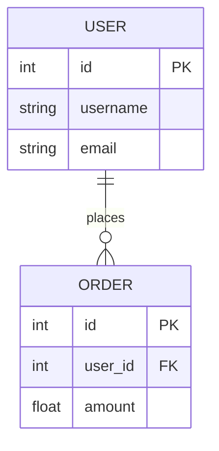
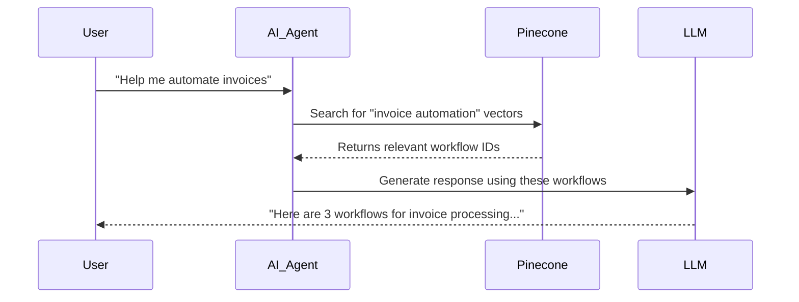

In the world of software development, databases are the unsung heroes. They are the digital vaults where we store everything from user profiles to complex AI embeddings. But with so many types available—SQL, NoSQL, Vector—it can be overwhelming to choose the right one.

In this guide, we'll break down how they work, their differences, and when to use which, drawing on examples from real-world projects like my own **n8n AI Automation Workflow Atlas**.

## What is a Database?

At its core, a database is an organized collection of data. Think of it as a high-tech filing cabinet.

- **Spreadsheet**: Good for a quick list, but hard to manage as it grows.
- **Database**: Designed for scale, speed, and security.

## The Three Main Players

### 1. Relational Databases (SQL)

SQL (Structured Query Language) databases are like strict accountants. They store data in **tables** with rows and columns. Every piece of data must fit a undefined structure (schema).

**Best for**: Financial systems, user accounts, inventory management where consistency is key.

**Popular Options**:
- **PostgreSQL**: The open-source powerhouse.
- **MySQL**: The web standard.
- **SQLite**: Lightweight, great for mobile apps.



### 2. NoSQL Databases

NoSQL databases are the creative artists. They are flexible and don't require a rigid schema. Data is often stored as **documents** (JSON-like), key-value pairs, or graphs.

**Best for**: Content management systems, real-time big data, flexible product catalogs.

**Popular Options**:
- **MongoDB**: The most popular document store.
- **Redis**: Blazing fast key-value store (often used for caching).
- **Cassandra**: Great for massive scale.

```mermaid
graph LR
    A[User Document] --> B{Attributes}
    B --> C[Name: "Ker102"]
    B --> D[Skills: ["AI", "Automation", "Dev"]]
    B --> E[Projects: { "n8n-atlas": "..." }]
```

### 3. Vector Databases (The AI Era)

This is where things get exciting. Vector databases don't just store text; they store **meaning**. They convert data (text, images, audio) into high-dimensional vectors (lists of numbers).

When you search a vector DB, you aren't looking for an exact keyword match. You are looking for **semantic similarity**.

**Best for**: AI applications, Semantic Search, Recommendation Systems, RAG (Retrieval Augmented Generation).

**Popular Options**:
- **Pinecone**: Managed vector database (used in my projects).
- **Weaviate**: Open-source vector search engine.
- **Chroma**: AI-native open-source embedding database.

## Visualizing the Difference

Here is how different databases might "see" a query for "Apple":

| Database Type | Query Logic | Result |
| :--- | :--- | :--- |
| **SQL** | `SELECT * FROM fruits WHERE name = 'Apple'` | Returns row with exact name "Apple". |
| **NoSQL** | `db.fruits.find({ name: "Apple" })` | Returns document for "Apple". |
| **Vector** | `search("Apple")` | Returns "Apple", "iPhone", "Fruit", "Pie" (concepts related to Apple). |

## Real-World Use Case: n8n AI Automation Atlas

In my project, [n8n-ai-automation-workflow-atlas](https://github.com/Ker102/n8n-ai-automation-workflow-atlas), I extensively use **Pinecone**, a vector database.

### Why Vector DB for this project?
The atlas contains thousands of workflows. A simple keyword search might fail if a user searches for "chatbot" but the workflow is named "conversational agent".

By using **Pinecone** for RAG (Retrieval Augmented Generation):
1. We convert the user's query ("I want to build a support bot") into a vector.
2. We search Pinecone for workflows with similar *meaning*.
3. We retrieve the relevant workflow templates, even if they don't share the exact same words.



## Summary: Which one to choose?

- **Choose SQL** if your data has a strict structure and relationships (e.g., an e-commerce store).
- **Choose NoSQL** if your data is unstructured or changing rapidly (e.g., a social media feed).
- **Choose Vector** if you are building AI applications that need to understand context and meaning (e.g., a semantic search engine or chatbot).

Databases are the backbone of modern software. Whether you are storing simple logs or complex AI embeddings, there is a specialized tool for the job.
